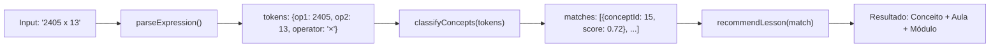

# PRD — Classificador Estrutural de Operações

## 1. Contexto e Problema

A Numetria é uma plataforma de performance cognitiva focada em cálculo mental estruturado. Seu motor pedagógico organiza **24 conceitos** em **5 módulos** progressivos, cada um com **3 aulas** (Estrutura, Compressão, Ritmo), totalizando **72 aulas**.

Atualmente, o usuário só acessa o conteúdo pedagógico navegando sequencialmente por módulos e conceitos. **Não existe entrada reversa**: o usuário não consegue digitar uma operação (ex: `2405 × 13`) e descobrir qual conceito e aula da Numetria cobre aquele tipo de cálculo.

Este PRD descreve a implementação de um **classificador estrutural** — um sistema que recebe uma expressão matemática livre, analisa sua estrutura, identifica os conceitos pedagógicos envolvidos e aponta a aula mais adequada.

> [!IMPORTANT]
> O sistema **NÃO resolve** a operação. Ele **classifica** a estrutura cognitiva necessária para resolvê-la mentalmente.

---

## 2. Objetivo

Permitir que o usuário insira uma operação matemática livre e o sistema:

1. **Analise estruturalmente** a operação (operandos, operador, magnitude, padrões numéricos).
2. **Identifique** quais conceitos do núcleo pedagógico estão envolvidos.
3. **Determine** a aula mais adequada dentro da arquitetura de progressão.
4. Se não existir aula correspondente, **retorne**: `"Aula não encontrada. Recomendação estrutural: [conceito base aplicável]."`

---

## 3. Escopo

### 3.1 Dentro do Escopo (MVP)

| Item | Descrição |
|------|-----------|
| Parser de expressão | Extrair operação, operandos e dados estruturais de uma string como `2405 x 13` |
| Regras de classificação | Mapear padrões numéricos aos 24 conceitos existentes |
| Ranqueamento de conceitos | Retornar conceito(s) relevante(s) com score de confiança |
| Recomendação de aula | Apontar `conceptId` + `lessonNumber` + fase do módulo |
| Fallback estrutural | Mensagem de recomendação quando nenhuma aula é match direto |
| Tela de entrada | Input para operação livre + exibição do resultado classificado |

### 3.2 Fora do Escopo (MVP)

- Resolução ou cálculo da operação
- Expressões com parênteses, potências ou múltiplas operações encadeadas
- Integração com o progresso do usuário (sugestão adaptativa personalizada)
- Geração dinâmica de exercícios a partir da operação digitada

---

## 4. Taxonomia de Conceitos (Base de Classificação)

O classificador mapeia operações contra esta taxonomia. Cada regra define **padrões de detecção** por operação e características dos operandos.

### 4.1 Módulo Fundacional (concept_id 1–8)

| ID | Conceito | Operação | Regra de Detecção |
|----|----------|----------|-------------------|
| 1 | Multiplicação por 5 | `×` | Um operando é `5` |
| 2 | Soma até 100 com transporte | `+` | Ambos operandos ≤ 100 e soma das unidades > 9 |
| 3 | Multiplicação por 9 | `×` | Um operando é `9` |
| 4 | Divisão exata por 2 | `÷` | Divisor é `2` e dividendo é par |
| 5 | Multiplicação por 2 e 4 | `×` | Um operando é `2` ou `4` |
| 6 | Adição de três parcelas | `+` | Três operandos presentes |
| 7 | Subtração com resultado positivo | `−` | Dois operandos, minuendo > subtraendo, ambos ≤ ~200 |
| 8 | Multiplicação por 10 e 100 | `×` | Um operando é `10` ou `100` |

### 4.2 Módulo Consolidação (concept_id 9–15)

| ID | Conceito | Operação | Regra de Detecção |
|----|----------|----------|-------------------|
| 9 | Subtração com empréstimo | `−` | Dígito(s) do subtraendo > dígito(s) correspondente(s) do minuendo |
| 10 | Multiplicação por 3 e 6 | `×` | Um operando é `3` ou `6` |
| 11 | Divisão por 3 e 6 | `÷` | Divisor é `3` ou `6` |
| 12 | Multiplicação por 7 e 8 | `×` | Um operando é `7` ou `8` |
| 13 | Divisão por 4 e 5 | `÷` | Divisor é `4` ou `5` |
| 14 | Multiplicação por 11 | `×` | Um operando é `11` |
| 15 | Divisão por 7 e 8 | `÷` | Divisor é `7` ou `8` |

### 4.3 Módulos Pro (concept_id 16–24)

| ID | Conceito | Regra de Detecção |
|----|----------|-------------------|
| 16 | Reconhecimento de Padrões | Operação com padrão detectável (ex: `25 × 4`, complementos) |
| 17–18 | Complementos Decimais | Operandos cujas unidades somam 10 ou 100 |
| 19–21 | Ritmo | Mesmas operações base, classificadas sob critério de velocidade |
| 22–24 | Precisão | Mistura ou alternância de operações |

### 4.4 Seleção de Aula

Dado o `conceptId` identificado, a aula recomendada segue a lógica:

| Aula | Nome | Quando Recomendar |
|------|------|-------------------|
| 1 | Estrutura | Operandos com magnitude baixa ou média (dentro do range do conteúdo existente) |
| 2 | Compressão | Operandos com magnitude moderada-alta |
| 3 | Ritmo e Transferência | Operandos com magnitude alta ou variações do padrão (ex: `50 × 36` como variação de `5 × 36`) |

---

## 5. Arquitetura Técnica

### 5.1 Componentes Propostos

```
src/
├── services/
│   └── operationClassifier.service.ts   ← [NEW] Motor de classificação
├── types/
│   └── classifier.ts                    ← [NEW] Tipos do classificador
├── app/
│   ├── pages/
│   │   └── OperationClassifier.tsx      ← [NEW] Página de entrada
│   └── routes.tsx                       ← [MODIFY] Adicionar rota
```

### 5.2 Fluxo de Dados



### 5.3 Interface do Serviço — `operationClassifier.service.ts`

```typescript
// Tipos principais
interface ParsedExpression {
  operand1: number;
  operand2: number;
  operand3?: number;         // para adição de 3 parcelas
  operator: 'addition' | 'subtraction' | 'multiplication' | 'division';
  raw: string;
}

interface ConceptMatch {
  conceptId: number;
  conceptName: string;
  moduleName: string;
  moduleId: string;
  confidence: number;        // 0.0 – 1.0
  reason: string;            // ex: "Um dos operandos é 5"
  isPro: boolean;
}

interface ClassificationResult {
  expression: ParsedExpression;
  matches: ConceptMatch[];    // ordenados por confidence desc
  recommendedLesson: {
    conceptId: number;
    lessonNumber: 1 | 2 | 3;
    lessonName: string;
    rationale: string;
  } | null;
  fallbackMessage: string | null;
}

// API pública
function classifyOperation(input: string): ClassificationResult;
```

### 5.4 Regras do Parser

O parser deve aceitar os seguintes formatos de entrada:

| Formato | Exemplo | Operação |
|---------|---------|----------|
| `A × B`, `A x B`, `A * B` | `2405 x 13` | Multiplicação |
| `A + B`, `A + B + C` | `48 + 37` | Adição |
| `A − B`, `A - B` | `92 - 47` | Subtração |
| `A ÷ B`, `A / B` | `84 / 2` | Divisão |

> [!NOTE]
> Espaços são opcionais. O sistema normaliza Unicode (`×` → `*`, `÷` → `/`, `−` → `-`).

### 5.5 Algoritmo de Classificação — Lógica de Prioridade

O classificador avalia a operação contra cada conceito usando **regras determinísticas** (sem ML). A prioridade segue:

1. **Match exato de operando especial**: operando é exatamente o fator-chave do conceito (ex: `× 5`, `÷ 2`)
2. **Match por decomposição**: operação pode ser decomposta em padrão conhecido (ex: `2405 × 13` → utiliza propriedade distributiva)
3. **Match por faixa de magnitude**: operandos dentro do range de exercícios de uma aula específica

Quando **múltiplos conceitos** casam (ex: `5 × 9` casa com conceito 1 **e** conceito 3), o sistema retorna ambos ranqueados. O conceito com o operando mais "especial" (mais restrito) tem prioridade.

### 5.6 Determinação da Aula

Dada uma classificação para `conceptId`, a aula é determinada por magnitude:

```typescript
function determineLessonNumber(conceptId: number, operands: number[]): 1 | 2 | 3 {
  const maxOperand = Math.max(...operands);

  // Ranges extraídos do conteúdo existente em lessonContent.ts
  if (maxOperand <= 30)  return 1;  // Aula Estrutura: operandos simples
  if (maxOperand <= 100) return 2;  // Aula Compressão: operandos moderados
  return 3;                          // Aula Ritmo: operandos grandes ou transferência
}
```

### 5.7 Fallback — Operação Não Classificada

Quando nenhum conceito casa diretamente, o sistema identifica o **conceito base mais próximo** pela operação:

```typescript
const BASE_FALLBACK: Record<string, { conceptId: number; name: string }> = {
  multiplication: { conceptId: 15, name: 'Propriedade distributiva mental' },
  addition:       { conceptId: 2,  name: 'Soma até 100 com transporte' },
  subtraction:    { conceptId: 9,  name: 'Subtração com empréstimo' },
  division:       { conceptId: 13, name: 'Divisão por 4 e 5' },
};
```

Mensagem retornada:
> `"Aula não encontrada. Recomendação estrutural: Propriedade distributiva mental (Conceito 15)."`

---

## 6. Design da Interface

### 6.1 Rota

- **URL**: `/classify`
- **Acesso**: usuários autenticados (free e pro)

### 6.2 Elementos da Tela

| Elemento | Descrição |
|----------|-----------|
| **Campo de entrada** | Input de texto com placeholder `"Ex: 2405 x 13"`, auto-focus, aceita Enter |
| **Botão Classificar** | Aciona a classificação (ícone de lupa/análise) |
| **Card de resultado** | Conceito identificado, módulo, aula recomendada, confidence, botão "Ir para aula" |
| **Lista secundária** | Outros conceitos relacionados (quando há múltiplos matches) |
| **Fallback** | Card com mensagem de recomendação estrutural quando não há match exato |
| **Estado vazio** | Instrução visual clara sobre o que digitar |

### 6.3 Comportamento de UX

- O campo aceita operações com ou sem espaços
- Feedback em tempo real (validação do formato)
- Se o resultado tiver aula existente, o botão "Ir para aula" navega para `/lesson/{conceptId}/{lessonNumber}`
- Se o conceito for Pro e o usuário for free, exibe `PaywallModal` ao clicar em "Ir para aula"
- Resultado fica na tela até nova classificação

---

## 7. Exemplos de Classificação

| Entrada | Conceito Principal | Módulo | Aula | Confidence |
|---------|-------------------|--------|------|------------|
| `5 × 14` | Multiplicação por 5 (ID 1) | Fundacional | 1 — Estrutura | 1.0 |
| `5 × 248` | Multiplicação por 5 (ID 1) | Fundacional | 3 — Ritmo | 1.0 |
| `48 + 37` | Soma até 100 c/ transporte (ID 2) | Fundacional | 1 — Estrutura | 0.95 |
| `9 × 256` | Multiplicação por 9 (ID 3) | Fundacional | 3 — Ritmo | 1.0 |
| `84 ÷ 2` | Divisão exata por 2 (ID 4) | Fundacional | 1 — Estrutura | 1.0 |
| `4 × 248` | Multiplicação por 2 e 4 (ID 5) | Fundacional | 3 — Ritmo | 1.0 |
| `7 + 8 + 3` | Adição de três parcelas (ID 6) | Fundacional | 1 — Estrutura | 1.0 |
| `74 − 38` | Subtração c/ resultado positivo (ID 7) | Fundacional | 1 — Estrutura | 0.9 |
| `47 × 10` | Multiplicação por 10 e 100 (ID 8) | Fundacional | 1 — Estrutura | 1.0 |
| `5 × 9` | ×5 (ID 1) + ×9 (ID 3) | Fundacional | 1 — Estrutura | 0.8 / 0.8 |
| `2405 × 13` | Propriedade distributiva | Fundacional | 3 — Ritmo | 0.6 |
| `50 × 36` | ×5 transferência (ID 1) | Fundacional | 3 — Ritmo | 0.85 |
| `√49` | — | — | — | Fallback: `"Operação não suportada"` |

---

## 8. Critérios de Aceite

### 8.1 Funcionais

- [ ] Parser reconhece os 4 operadores (`+`, `−`, `×`, `÷`) em múltiplos formatos
- [ ] Parser aceita 2 ou 3 operandos
- [ ] Parser rejeita expressões inválidas com mensagem clara
- [ ] Classificação retorna conceito correto para cada um dos 15 conceitos fundacionais
- [ ] Classificação retorna conceito correto para cada um dos 7 conceitos de consolidação
- [ ] Conceitos Pro são retornados com flag `isPro: true`
- [ ] Quando operação encaixa em 2+ conceitos, ambos são retornados ranqueados
- [ ] Aula recomendada varia corretamente por magnitude dos operandos (1/2/3)
- [ ] Operações sem match retornam fallback com recomendação estrutural
- [ ] Resultado inclui `reason` legível para o humano

### 8.2 UX

- [ ] Tela acessível via rota `/classify`
- [ ] Input aceita Enter para classificar
- [ ] Resultado exibe card com conceito, módulo, aula e botão de navegação
- [ ] Conceitos Pro exibem badge "PRO" e abrem `PaywallModal` se usuário for free
- [ ] Estado vazio exibe instrução visual clara
- [ ] Responsivo (mobile + desktop)
- [ ] Segue design system Numetria (`BlueprintCard`, `ActionButton`, variáveis CSS)

---

## 9. Plano de Verificação

### 9.1 Testes Unitários

Criar `src/services/__tests__/operationClassifier.test.ts` com os seguintes cenários:

```
- Parser: formatos variados (espaços, Unicode, sem espaços)
- Parser: expressões inválidas (letras, vazias, operadores desconhecidos)
- Classificação: match exato para cada conceito 1–15
- Classificação: match múltiplo (ex: 5 × 9)
- Classificação: determinação de aula por magnitude
- Classificação: fallback para operações não cobertas
- Classificação: conceitos Pro com flag isPro
```

**Comando para executar:**
```bash
npx vitest run src/services/__tests__/operationClassifier.test.ts
```

### 9.2 Teste Manual (Browser)

1. Abrir `http://localhost:5173/classify` (com usuário logado)
2. Digitar `5 × 14` → esperar card com "Multiplicação por 5", Módulo Fundacional, Aula 1
3. Digitar `9 × 256` → esperar Aula 3 — Ritmo
4. Digitar `7 + 8 + 3` → esperar "Adição de três parcelas"
5. Digitar `2405 × 13` → esperar fallback com recomendação de conceito base
6. Digitar `abc` → esperar mensagem de erro de formato
7. Clicar em "Ir para aula" → verificar navegação para `/lesson/{id}/{number}`

---

## 10. Estimativa de Esforço

| Componente | Estimativa |
|------------|-----------|
| `classifier.ts` (tipos) | ~30 min |
| `operationClassifier.service.ts` (parser + regras) | ~2–3h |
| `OperationClassifier.tsx` (tela) | ~2–3h |
| Rota + navegação | ~15 min |
| Testes unitários | ~1–2h |
| Testes manuais + ajustes | ~1h |
| **Total estimado** | **~7–10h** |

---

## 11. Dependências e Riscos

| Risco | Mitigação |
|-------|-----------|
| Conceitos 9–24 não têm aulas implementadas em `lessonContent.ts` | O botão "Ir para aula" só fica ativo para conceitos com conteúdo. Demais exibem badge "Em breve" |
| Ambiguidade em operações (ex: `5 × 9`) | Retornar lista ranqueada com explicação |
| Operações multi-etapa ou com parênteses | Fora do escopo MVP; parser rejeita com mensagem clara |
| Gap entre UI e persistência pedagógica (já documentado em `resumo-modulos-aulas.md`) | Classificador é read-only, não depende de persistência de sessão |

---

## 12. Iterações Futuras (Pós-MVP)

- **Integração com progresso do usuário**: sugerir a aula com base no status atual do aluno
- **Expressões compostas**: `(25 × 4) + 13` decomposta em sub-operações classificadas individualmente
- **Modo "diagnóstico"**: sequência de N operações para mapear perfil cognitivo do usuário
- **Sugestão inversa**: "Você está na Aula 2 de Multiplicação por 9 — pratique com estas operações"
